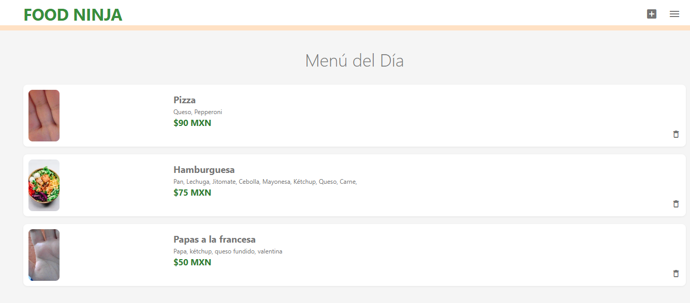
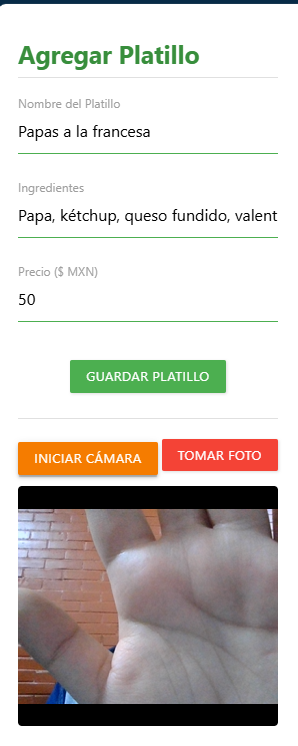
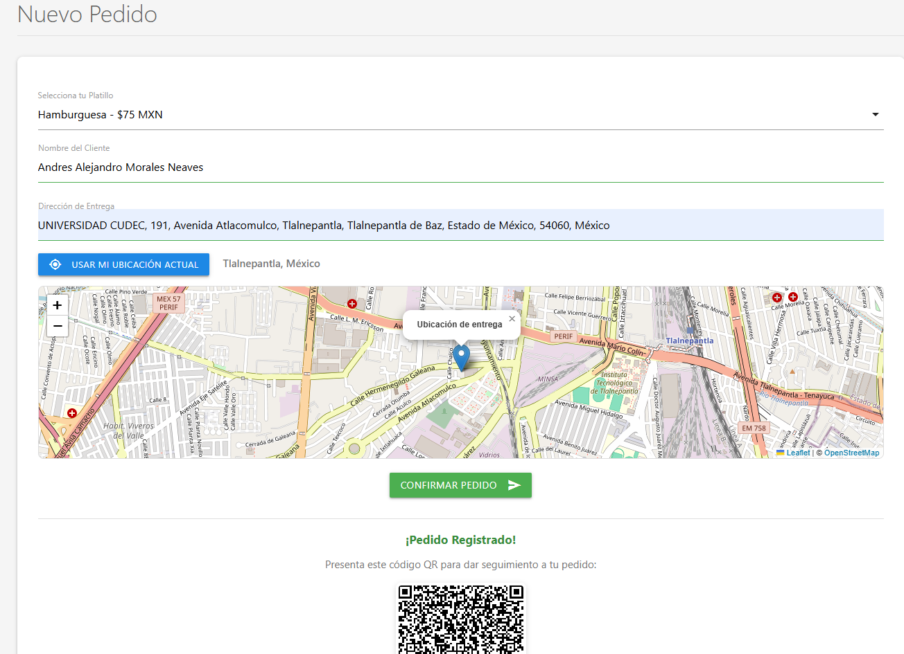
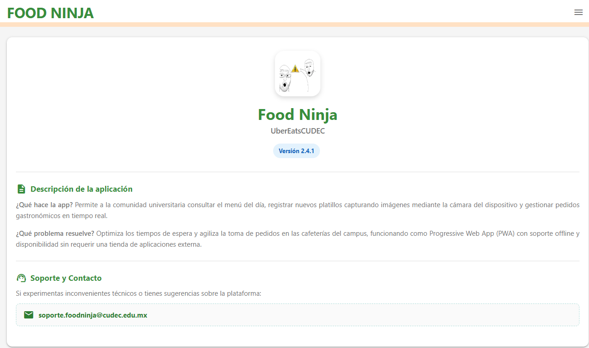
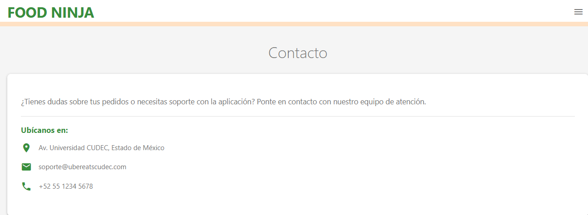

# Food Ninja - UberEatsCUDEC

**Tipo de Aplicación:** Progressive Web App (PWA)  
**Descripción:** Aplicación web progresiva diseñada para agilizar la consulta del menú gastronómico, registro de platillos y gestión de pedidos dentro del campus universitario.  

* **Materia:** [Taller de programacion 2]
* **Carrera:** [Ingeniería en Sistemas Computacionales]
* **Alumno:** [Andres Alejandro Morales Neaves]
* **Grupo:** [09/ISC - 182]
* **Institución:** Centro Universitario CUDEC

---

## 2. Descripción del Proyecto

**Food Ninja / UberEatsCUDEC** es una PWA creada para optimizar los tiempos de espera y agilizar el proceso de pedido en las cafeterías universitarias. Permite a los usuarios consultar la oferta gastronómica diaria en tiempo real, tomar capturas de platillos directamente desde la cámara de sus dispositivos y realizar compras de forma rápida e intuitiva. Gracias a su arquitectura PWA con Service Worker, la aplicación ofrece capacidad de trabajo sin conexión (offline) e instalabilidad en dispositivos móviles y de escritorio.

---

## 3. Objetivos

### Objetivo General
Desarrollar una Progressive Web App (PWA) funcional, accesible e interactiva que permita la gestión digital de pedidos gastronómicos y la consulta del menú diario para la comunidad del campus universitario.

### Objetivos Específicos
* Implementar un diseño responsivo adaptado a dispositivos móviles mediante el framework Materialize CSS.
* Configurar un Service Worker y un manifiesto web (`manifest.json`) para habilitar capacidades offline, almacenamiento en caché y compatibilidad PWA.
* Integrar Firebase / Firestore para la persistencia de datos en tiempo real de los pedidos y productos.
* Incorporar funciones avanzadas de hardware como captura de imágenes a través de la cámara e interacción con mapas.

---

## 4. Características Principales

* 📱 **Experiencia PWA Completa:** Instalable en pantalla de inicio, con pantalla de carga (*splash screen*) y soporte offline.
* 🍽️ **Menú Interactivo:** Consulta y navegación visual por los diferentes platillos del día.
* 📷 **Registro de Platillos:** Captura de imágenes directamente desde la cámara del dispositivo para subir nuevos menúes.
* 🛒 **Gestión de Pedidos:** Proceso simplificado para la selección y generación de órdenes en tiempo real.
* 🧭 **Navegación Intuitiva:** Menú lateral (*Sidenav*) fluido accesible desde cualquier sección (Inicio, Pedidos, Acerca de y Contacto).

---

## 5. Tecnologías Utilizadas

| Tecnología / Herramienta | Descripción / Versión |
| :--- | :--- |
| **HTML5 & CSS3** | Estructuración semántica y estilos de interfaz |
| **JavaScript (ES6+)** | Lógica de la aplicación y manejo del DOM |
| **Materialize CSS** | Framework de diseño (v1.0.0) |
| **Service Workers** | Precaché y estrategia de respuesta offline |
| **Firebase / Firestore** | Base de datos NoSQL en tiempo real |
| **Git / GitHub Pages** | Control de versiones y despliegue continuo |

---

## 6. Estructura del Proyecto

```text
UberEatsCUDEC1-main/
│
├── css/
│   └── styles.css          # Estilos personalizados de la aplicación
├── js/
│   ├── app.js              # Registro del Service Worker y lógica principal
│   ├── ui.js               # Eventos de la interfaz y componentes Materialize
│   ├── pedidos.js          # Lógica para la gestión de compras y pedidos
│   ├── firebase.js         # Configuración y conexión con Firebase
│   └── qrcode.min.js       # Librería para la generación de códigos QR
├── pages/
│   ├── about.html          # Vista "Acerca de"
│   ├── contact.html        # Vista de contacto y soporte
│   └── pedidos.html        # Vista para el registro y gestión de órdenes
├── iconos/                 # Conjunto de iconos PWA para diferentes resoluciones
├── index.html              # Página principal (Inicio / Menú)
├── manifest.json           # Configuración del Manifiesto PWA
├── sw.js                   # Service Worker para precaché y soporte offline
└── README.md               # Documentación del proyecto!
```
## 7. Evidencias / Capturas de Pantalla

| Pantalla | Vista Previa |
| :--- | :---: |
| **Inicio** |  |
| **Registrar Platillo** |  |
| **Realizar Pedido** |  |
| **Acerca de** |  |
| **Contacto** |  
---

## 8. Base de Datos

* **Motor Utilizado:** Cloud Firestore (Firebase) - Base de datos NoSQL orientada a documentos en tiempo real.
* **Colecciones Principales:**
  * `platillos`: Almacena la información de los productos del menú (nombre, descripción, precio, URL de la imagen/captura).
  * `pedidos`: Almacena el detalle de las compras realizadas por los usuarios (lista de platillos, fecha/hora, estado del pedido, código QR generado, total).

---

## 9. Licencia

Este proyecto fue desarrollado con fines académicos como parte de la carrera de **Ingeniería en Sistemas Computacionales**, para la materia **Taller de programación 2**, del grupo **09/ISC - 182** en el **Centro Universitario CUDEC**.

---